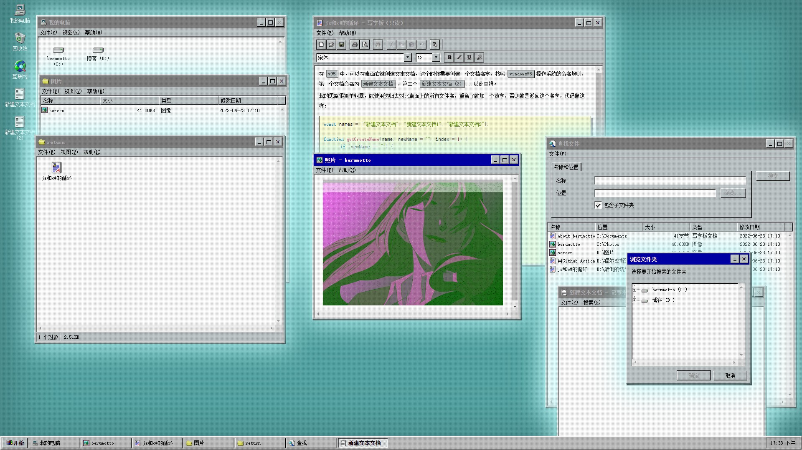

# w95

基于 `vue` 的 `windows95` 风格静态网站

👉 [https://noberumotto.github.io/](https://noberumotto.github.io/)
<p align="left">
  <a href="https://noberumotto.github.io/"> </a>
</p>

在UI上尽可能的还原windows95了，也加入了一些我自己的想法，像模拟了老式显示器上的颗粒感，所以看上去会比较模糊。

### 支持

- markdown文件、jpg/png/webimg格式图片、txt文件
- 基于文件名称的简单搜索功能
- 设置开机密码（当然只是摆设，毕竟密码明文存储在前端文件中）
- 文件夹视图切换，图标、详细信息两种

### 启动
```
npm install
npm run w95file #生成 我的电脑 文件结构
npm run serve #开发预览
npm run build #生成静态文件
```

### 生成我的电脑文件结构
```
npm run w95file
```
执行完毕后可以看到创建了一个 `disk` 文件夹，这里就是 `我的电脑` 文件夹，默认会创建一个 `C盘` ，将markdown、图片丢进去，然后再执行一次命令，你就能在 `我的电脑` 中相应的位置下看到它们。

#### 支持显示网络图片 .webimg

创建一个.webimg格式的文件，打开它，然后将一个网络图片URL粘贴进去。

#### 开机密码

在 src\config.js 中配置

#### 图片显示

如果是本地图片会自动加入一种 `工作不正常` 的滤镜
